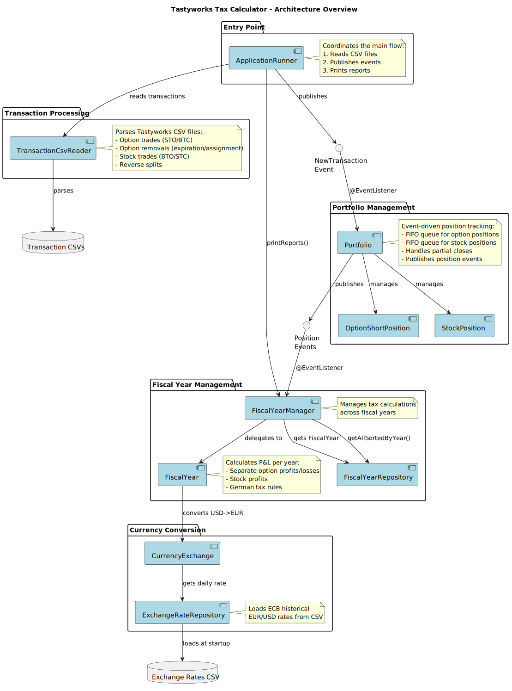
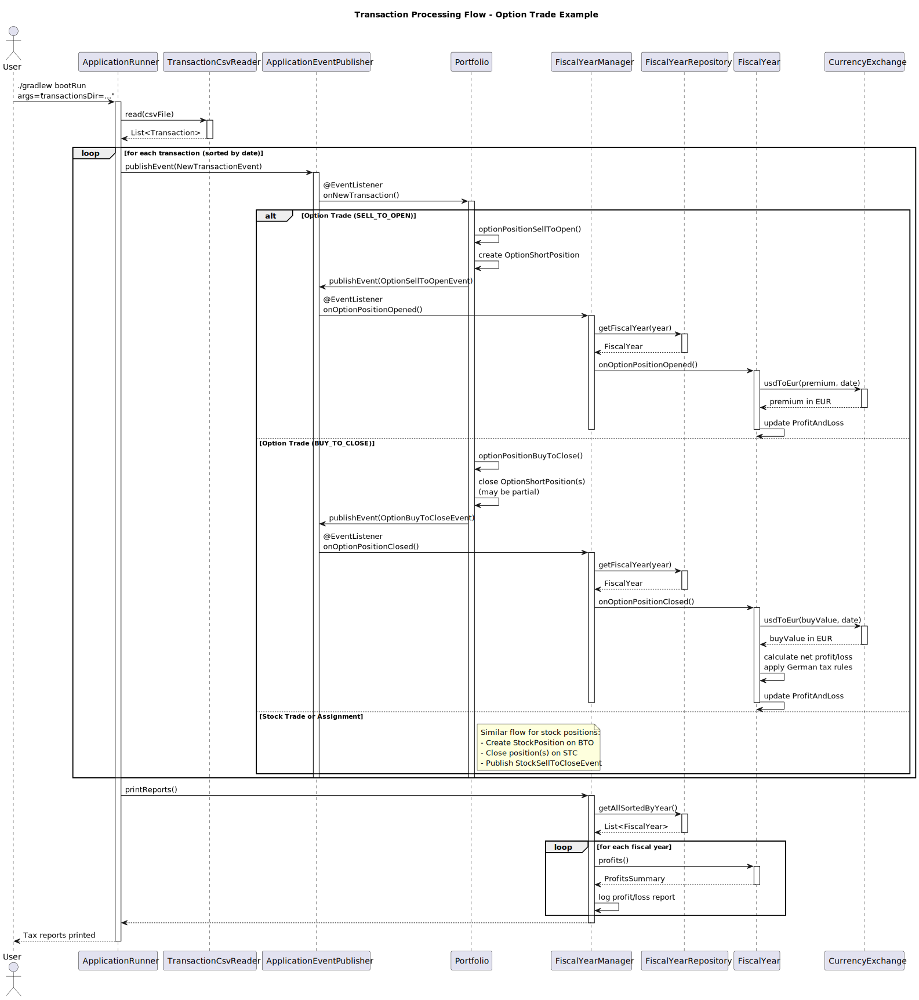

# Tastyworks Tax Calculator
This is a command line program to calculate win and loss from option trades with the Tastyworks
broker for the german tax.

## Haftungsausschluss / Disclaimer

**Deutsch:**

Dieses Tool dient ausschließlich zu Informationszwecken und stellt keine Steuerberatung dar. Die Berechnungen erfolgen nach bestem Wissen und Gewissen, jedoch wird keine Gewähr für die Richtigkeit, Vollständigkeit oder Aktualität der bereitgestellten Informationen übernommen.

Die Nutzung dieses Tools erfolgt auf eigene Verantwortung. Der Autor übernimmt keine Haftung für etwaige Fehler in den Berechnungen oder für Schäden, die aus der Verwendung dieses Tools entstehen könnten.

Für steuerliche Fragen konsultieren Sie bitte einen qualifizierten Steuerberater oder das zuständige Finanzamt.

**English:**

This tool is provided for informational purposes only and does not constitute tax advice. Calculations are made to the best of our knowledge, but no guarantee is given for the accuracy, completeness, or currentness of the information provided.

Use of this tool is at your own risk. The author assumes no liability for any errors in the calculations or for damages that may arise from the use of this tool.

For tax-related questions, please consult a qualified tax advisor or the relevant tax authority.

# Run
- Download your transactions from the Tastyworks application and store them in a directory.
- Download the exchange rates from ecb and put the im the resources directory.
- Run the application and provide the directory where the Tastywork transaction csv files are located:
`--transactionsDir=...`

# Exchange Rates
Exchange rates are static from file `src/main/resources/eurofxref-hist.csv`. Download time series from ECB to update
https://www.ecb.europa.eu/stats/eurofxref/eurofxref-hist.zip?9c8efb82354da0f4694f95dfb4a4e167

## Architecture

### System Overview

### Transaction Processing Flow

